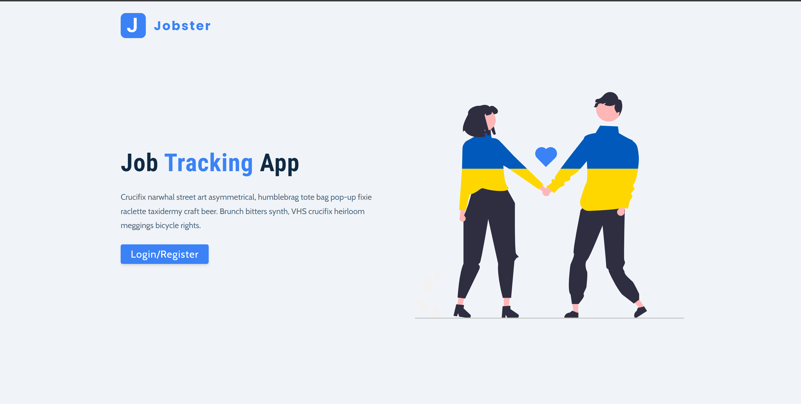
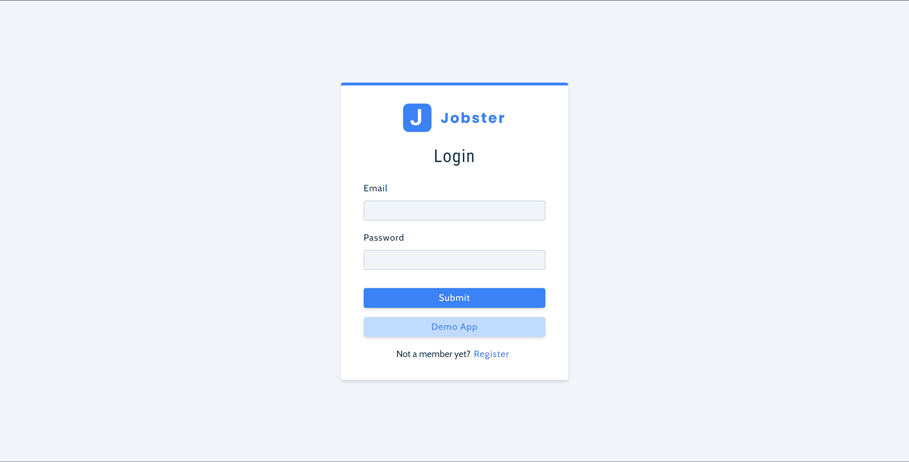
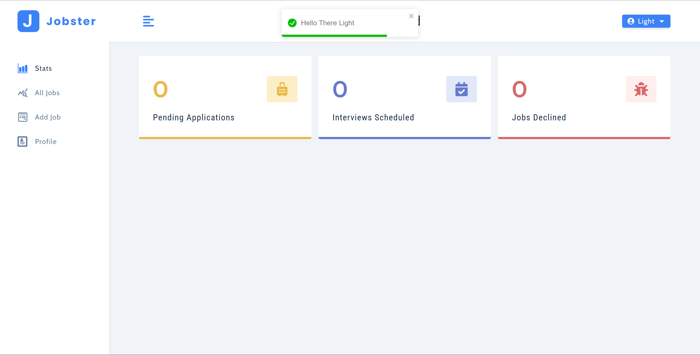
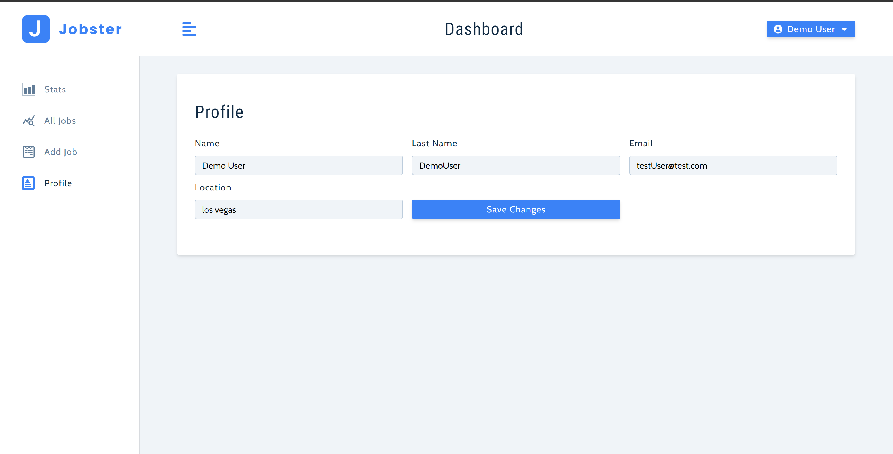
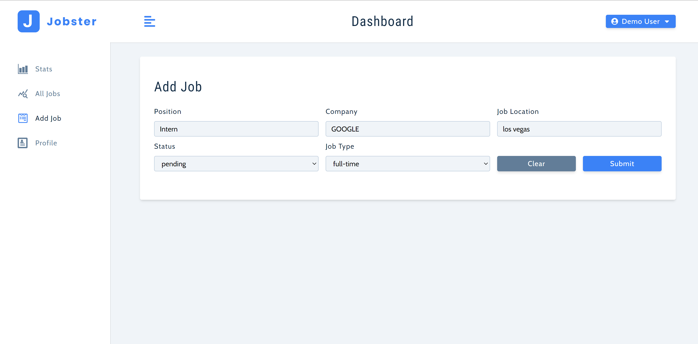
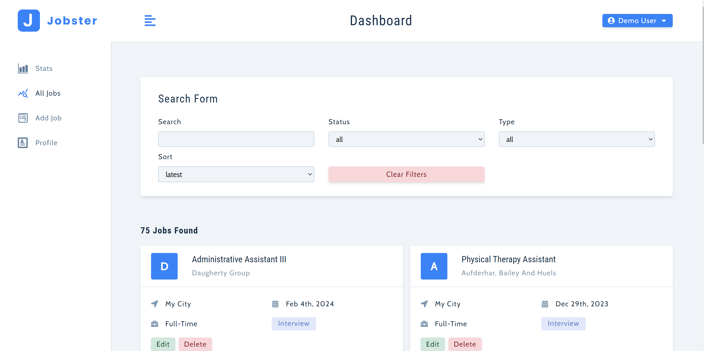
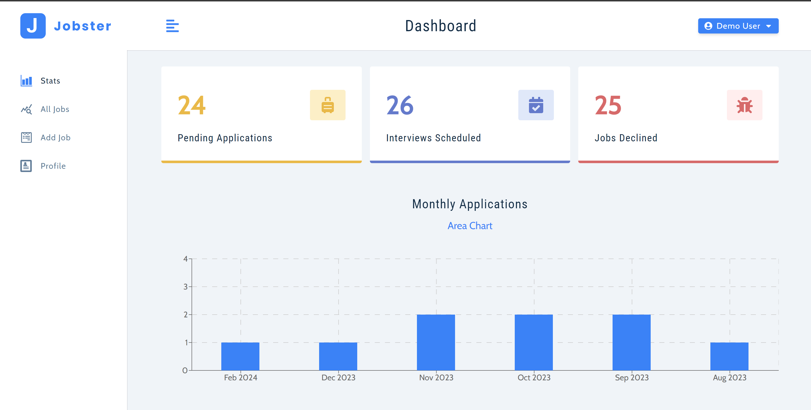
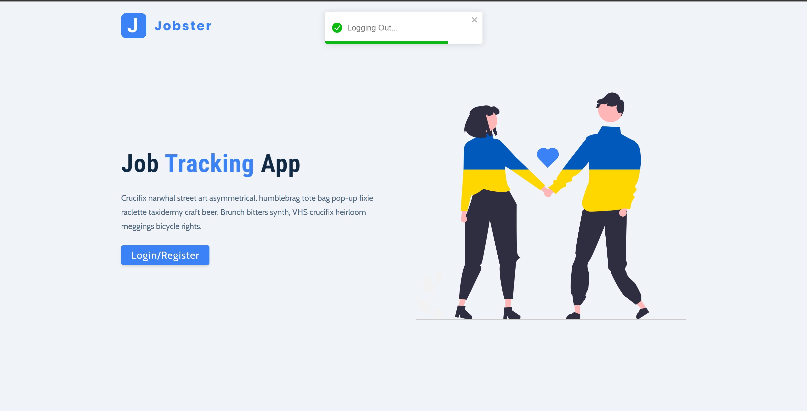

# Jobster



Welcome to Jobster a webapp built  with Node.js and Express. It provides users with a platform to manage their daily job search. 

Project is [Live Here.](https://job-tracking-app-d1km.onrender.com/)

## Setup

1. Clone the repository:

    ```bash
    git clone https://github.com/Olusegun-Light/Job-Tracking-App
    cd jobs-tracking-app
    ```

2. Install dependencies:

    ```bash
    npm install
    ```

3. Set up environment variables:

    ```bash
    PORT=3000
    MONGO_URI=<your_mongodb_connection_string>
    JWT_SECRET=<your_jwt_secret_key>
    JWT_LIFETIME=<token_lifetime>
    ```

4. Start the server:

    ```bash 
    npm run dev 
    ```

## Features

- User authentication (register, login)
- CRUD operations for managing jobs (create, read, update, delete)
- Authentication middleware for protecting job routes
- Error handling middleware for managing various error types

## How to use Jobser

Discover the simplicity of navigating through Jobser with these easy steps:


### Page Overview (Home Page)


### Create Your Account (Signup)

Fill in the form with your unique email, ensuring each email is exclusive to a user.



### Login into your account (Login)

If you already have an account, simply log in.


### Demo

Login as a demo user to test out the project.

### Upon Successful Login or Account Creation

You'll be redirected to the home page.



### Access Your Profile

Click the icon displaying your profile to visit your profile. Here, you can adjust settings.



### Add Job



### All Jobs

Check all the jobs you have applied to and also search through to make things easier.




### Stats 

Check the stats of your applied jobs.




### Logout
And lastly logout of the account.




## To know more about the backend, do well to check the [jobs api](https://github.com/Olusegun-Light/Jobs-API) 